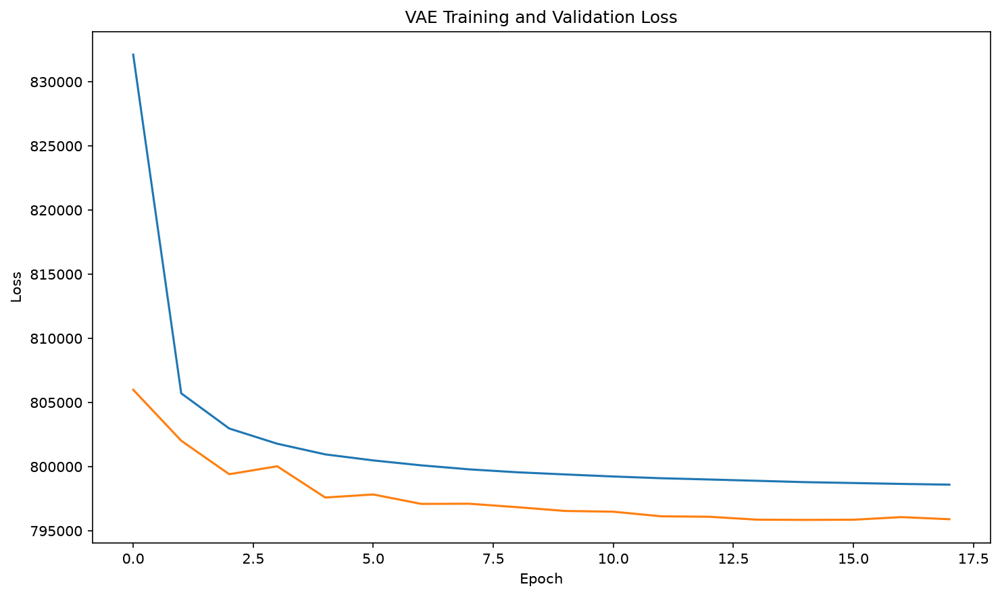
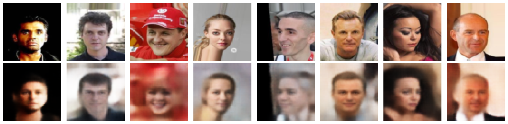
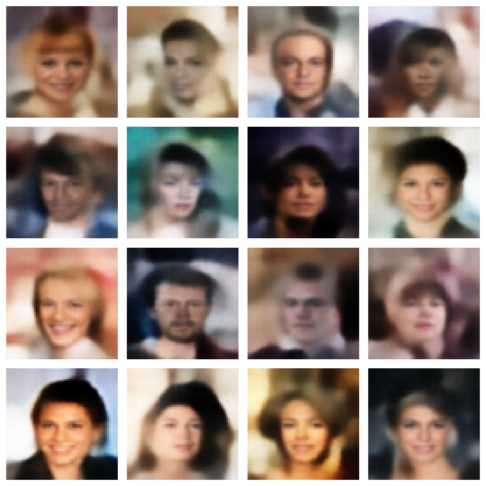
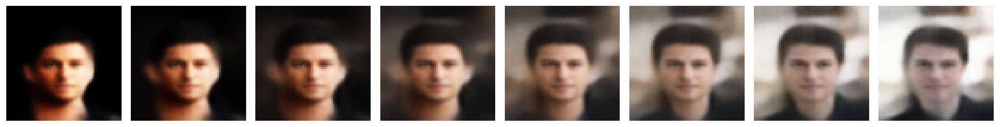

````markdown
# VAE on CelebA

A small **Variational Autoencoder (VAE)** implemented with PyTorch and trained on the CelebA dataset.

> **This is a learning project.**  
> The main purpose of this project is to understand how Variational Autoencoders work both mathematically and practically, rather than to build a state-of-the-art image generation model.

## About the Project

I built this project as a hands-on way to learn about **Generative AI, Variational Autoencoders, latent spaces, and generative modeling**.

The project implements the complete VAE pipeline:

```text
Input Image
     ↓
   Encoder
     ↓
 μ and logvar
     ↓
Reparameterization
     ↓
 Latent Vector z
     ↓
   Decoder
     ↓
Reconstructed Image
````

The model can also generate new images by sampling from the latent space and can interpolate between different latent representations.

## What I Learned

Through this project, I focused on understanding:

* How a VAE differs from a traditional Autoencoder
* How the encoder learns `μ` and `logvar`
* What the latent space represents
* Why the reparameterization trick is necessary
* How random sampling can still be used with backpropagation
* Reconstruction loss
* KL divergence
* How KL divergence regularizes the latent space
* How new samples can be generated from `N(0, I)`
* Latent-space interpolation
* Training and validation loops in PyTorch
* GPU training with CUDA
* Model checkpointing
* Early stopping
* Visualizing model results

## Model Architecture

The model works with RGB images resized to:

```text
64 × 64 × 3
```

### Encoder

```text
3 × 64 × 64
      ↓
Conv2D: 3 → 32
      ↓
Conv2D: 32 → 64
      ↓
Conv2D: 64 → 128
      ↓
128 × 8 × 8
      ↓
Flatten
      ↓
8192
```

The encoder produces two vectors:

```text
μ
logvar
```

with a latent dimension of:

```text
128
```

### Reparameterization

The latent vector is obtained using:

```text
σ = exp(0.5 × logvar)

z = μ + εσ
```

where:

```text
ε ~ N(0, I)
```

This allows the model to sample from the latent distribution while still allowing gradients to flow during training.

### Decoder

The decoder reconstructs the image from the latent vector:

```text
Latent Vector
      ↓
Linear Layer
      ↓
128 × 8 × 8
      ↓
ConvTranspose2D
      ↓
64 × 16 × 16
      ↓
ConvTranspose2D
      ↓
32 × 32 × 32
      ↓
ConvTranspose2D
      ↓
3 × 64 × 64
```

The final sigmoid activation produces pixel values in the range `[0, 1]`.

## Loss Function

The VAE uses two components:

```text
Total Loss = Reconstruction Loss + KL Divergence
```

### Reconstruction Loss

Binary Cross Entropy is used to encourage the reconstruction to resemble the original image.

### KL Divergence

The KL divergence encourages the learned latent distributions to remain close to:

```text
N(0, I)
```

This regularization makes the latent space more structured and allows the model to generate new samples by sampling from a standard normal distribution.

## Dataset

This project uses the **CelebA** dataset.

Images are resized to `64 × 64` and divided into:

```text
90% Training
10% Validation
```

The dataset itself is **not included in this repository**.

Place the images inside:

```text
data/img_align_celeba/
```

## Training

The main training configuration is:

| Parameter               |                          Value |
| ----------------------- | -----------------------------: |
| Image Size              |                        64 × 64 |
| Latent Dimension        |                            128 |
| Batch Size              |                            128 |
| Optimizer               |                           Adam |
| Learning Rate           |                          0.001 |
| Train/Validation Split  |                          90/10 |
| Loss                    | Reconstruction + KL Divergence |
| Early Stopping Patience |                              3 |
| Device                  |            CUDA when available |

To train the model:

```bash
python train.py
```

The training process includes training and validation loss tracking, checkpointing, and early stopping.

## Results

### Loss Curve



### Image Reconstruction

The model can reconstruct images from their latent representations.



### Random Generation

New latent vectors can be sampled from `N(0, I)` and passed through the decoder to generate new images.



### Latent Interpolation

The project also demonstrates interpolation between two latent representations.

```text
z(t) = (1 - t)z₁ + tz₂
```



The interpolation demonstrates that the learned latent space contains a continuous representation where the generated faces can gradually change from one representation to another.

## Project Structure

```text
vae_celebA/
│
├── data/
│   └── img_align_celeba/
│
├── checkpoints/
│   └── best_model.pth
│
├── results/
│   ├── generated/
│   │   └── generated_faces.png
│   ├── interpolation/
│   │   └── latent_interpolation.png
│   ├── plots/
│   │   └── loss_curve.png
│   └── reconstructions/
│       └── reconstruction.png
│
├── dataset.py
├── model.py
├── loss.py
├── train.py
├── test_model.py
├── reconstruct.py
├── generate.py
├── interpolate.py
├── plot_losses.py
├── requirements.txt
└── README.md
```

## Technologies

* Python
* PyTorch
* Torchvision
* Pillow
* NumPy
* Matplotlib
* tqdm
* CUDA

## Limitations

This project is intentionally small and was created primarily for learning.

Because of the relatively small architecture and `64 × 64` image resolution, the generated images are blurry and do not have the quality of modern generative models.

This project does not attempt to compete with modern models such as GANs or diffusion models.

## Future Experiments

Possible future experiments include:

* Increasing image resolution
* Using a larger VAE architecture
* Increasing the latent dimension
* Experimenting with β-VAE
* Trying different reconstruction losses
* Adding perceptual loss
* Comparing different VAE architectures
* Evaluating generated images using FID and other metrics
* Exploring Conditional VAEs
* Comparing VAE representations with standard Autoencoders
* Comparing VAEs with other generative models

## Purpose

This repository documents my process of learning **Generative AI and Variational Autoencoders** through implementation and experimentation.

Rather than simply using an existing VAE implementation, I built the main components myself to better understand the underlying mathematics and how the different parts of a VAE work together.

**This is a learning project, not a production-ready or state-of-the-art generative model.**

```
```
